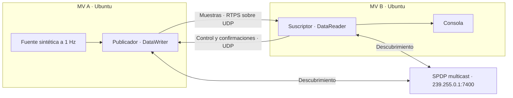

# NMEA DDS demo: RustDDS y OpenDDS

## ¿De qué trata el proyecto?

Demo de publicación y suscripción de datos de navegación mediante DDS (Data Distribution Service). Es **el mismo programa implementado en dos frameworks**: RustDDS **0.11.2** (Rust, Atostek) y OpenDDS **3.34.0** (C++). Cada implementación tiene un publicador y un suscriptor y utiliza el mismo contrato [Navigation.idl](idl/Navigation.idl).

La fuente sintética produce aproximadamente una muestra por segundo con secuencia, timestamp, posición, velocidad en nudos, rumbo y profundidad. Sirve para comprobar el transporte; no representa un recorrido físico coherente. También existe entrada GPRMC por UDP, descrita como capacidad en las guías de implementación.

## Arquitectura



El descubrimiento SPDP anuncia participantes; SEDP descubre los extremos compatibles. Después, el lector recibe las muestras del escritor. Reliable necesita tráfico de retorno incluso cuando las muestras fluyen en una sola dirección. No se configura una IP remota ni un servidor central de descubrimiento.

Los roles pueden intercambiarse: MV A puede ser suscriptora y MV B publicadora. Ejecutar **una implementación a la vez**, usando el mismo DDS en ambos extremos y un participante por MV. No se ha validado interoperabilidad RustDDS↔OpenDDS.

Contrato común: dominio **0**, tópico **MarineNavigation**, tipo **Marine::Navigation**, sin clave (**NoKey**). Ambos demos delegan la gestión de interfaces a sus bibliotecas y al sistema operativo, sin solicitar IP local ni remota. Esto iguala la ausencia de selección manual, no sus algoritmos internos ni todas sus políticas de transporte. Con varias interfaces, VPN o rutas inadecuadas puede faltar conectividad. El transporte es RTPS/UDP; el detalle de multicast/unicast y puertos está en [MULTICAST.md](MULTICAST.md).

## QoS utilizadas y alcance de las pruebas

| Política | Valor | RustDDS | OpenDDS |
| --- | --- | --- | --- |
| Reliability | Reliable | Explícita | Explícita en escritor y lector |
| Máximo bloqueo de escritura | 1 segundo | Explícito | Explícito |
| History | KeepLast, profundidad 10 | Explícita | Explícita en escritor y lector |
| Durability | Volatile | Comportamiento predeterminado; no se establece en el builder | Explícita en escritor y lector |

KeepLast(10) limita el historial, no garantiza reproducir diez muestras a un lector nuevo. Volatile no promete recuperar muestras anteriores a la asociación. La primera secuencia recibida puede ser mayor que uno. No hay opciones CLI para cambiar estas QoS.

**Prueba reportada por el usuario:** dos MV Ubuntu **26.04.1 LTS**, en el mismo equipo físico, con VMware **Bridged** y selección explícita del adaptador físico de Internet en el editor de red virtual (Intel(R) WiFi en el equipo probado). RustDDS y OpenDDS recibieron muestras sintéticas por separado; al invertir publicador y suscriptor, ambas MV recibieron correctamente.

La prueba OpenDDS correspondía a la configuración anterior con selección explícita de IP; no valida el nuevo modo automático. La aceptación del modo automático entre MV queda pendiente de comprobar asociación, recepción sintética e inversión de roles. La prueba anterior confirma descubrimiento y entrega sintética en ambos sentidos para las configuraciones utilizadas entonces. No confirma NMEA, reinicios, duración específica, capturas, tolerancia a pérdidas ni recuperación del historial. Los tests locales tampoco sustituyen una prueba entre MV. Los timestamps no miden latencia sin sincronización de relojes. El demo no configura DDS Security ni traducción de NAT.

## Descargar y elegir una guía

En **ambas MV**, trabajar en el sistema de archivos Ubuntu, recomendado `~/projects/nmea-dds-demo`. Se necesita Internet para descargar herramientas y dependencias:

```bash
sudo apt update
sudo apt install -y git ca-certificates
mkdir -p "$HOME/projects"
cd "$HOME/projects"
git clone --branch feature/multicast-discovery https://github.com/MariaAmor8/nmea-dds-demo.git
cd nmea-dds-demo
git branch --show-current
```

Resultado esperado: la rama indicada es `feature/multicast-discovery`. Compilar independientemente en cada MV; no copiar binarios, `target/` ni cachés CMake. No se necesita un editor instalado ni usar sudo para compilar o ejecutar.

Continuar con [guía RustDDS](rustdds/README.md) o [guía OpenDDS](opendds/README.md). Ambas empiezan desde este clon y explican instalación, red, compilación, ejecución y resultados. Para actualizar posteriormente, con el trabajo local guardado, usar `git pull --ff-only` en cada clon.

## Estructura general

| Ubicación | Función |
| --- | --- |
| `idl/` | Contrato único de navegación |
| `rustdds/` | Aplicaciones Rust, parser NMEA y pruebas |
| `opendds/` | Aplicaciones C++, CMake, scripts de entorno/build y pruebas |
| `tools/` | Generador Rust desde IDL, diagnóstico UDP y observador SPDP |
| `run.sh` | Selector de implementación y rol desde Bash |
| `Cargo.toml`, `Cargo.lock` | Workspace y dependencias Rust fijadas |
| `target/`, `opendds/build-linux/` | Artefactos generados, excluidos de Git |

Rust genera tipos durante el build mediante Python; el generador admite el subconjunto IDL de este proyecto, no es un compilador general. OpenDDS genera C++ desde una entrada adaptada automáticamente por CMake para el miembro `sequence`, sin modificar el contrato compartido. No editar tipos generados ni mantener otro IDL manualmente.

Usar `logs/`, `captures/`, `results/` y `tmp/` para artefactos locales: están ignorados por Git. No compartir credenciales ni rutas personales.

## Scripts Python y momento de ejecución

| Script | Función y momento de ejecución |
| --- | --- |
| `tools/idl_to_rust.py` | Genera tipos Rust desde el IDL; `rustdds/build.rs` lo invoca automáticamente durante la compilación cuando corresponde |
| `tools/udp_probe.py` | Diagnóstico manual de UDP de ida y vuelta por puerto 17400, independiente de DDS |
| `tools/capture_spdp.py` | Observación manual de anuncios mientras un participante RustDDS u OpenDDS está activo; muestra interfaz, TTL y direcciones anunciadas |
| `tools/tests/test_capture_spdp.py` | Prueba manual del observador con paquetes simulados; no participa en la comunicación |
| `rustdds/tests/multicast.py` | Prueba local manual después de compilar; arranca publicador/suscriptor y comprueba sus resultados |
| `opendds/tests/integration.py` | Prueba local lanzada por CTest al habilitar `--integration-tests`; arranca procesos y comprueba sus resultados |

El generador participa en la compilación, no en la red. Las integraciones controlan procesos y revisan logs; también inyectan entrada NMEA por UDP para probar esa fuente, pero las muestras DDS viajan directamente entre los ejecutables y no pasan por Python. El probe y el observador son diagnósticos opcionales: no reenvían muestras ni realizan el descubrimiento DDS.

Los comandos se ejecutan desde la raíz del repositorio. Consultar [diagnóstico y observación](MULTICAST.md), [pruebas RustDDS](rustdds/README.md) y [pruebas OpenDDS](opendds/README.md). Para probar el observador sin sockets reales:

```bash
python3 -m unittest discover -s tools/tests -p 'test_capture_spdp.py'
```

Resultado esperado: pruebas aprobadas. Observar anuncios SPDP o aprobar pruebas locales no demuestra entrega entre MV.

## Referencias

- [RustDDS 0.11.2](https://docs.rs/rustdds/0.11.2/) y [repositorio oficial](https://github.com/Atostek/RustDDS).
- [OpenDDS 3.34.0](https://github.com/OpenDDS/OpenDDS/releases/tag/v3.34.0) y [guía oficial de compilación](https://opendds.readthedocs.io/en/latest-release/devguide/building/index.html).
